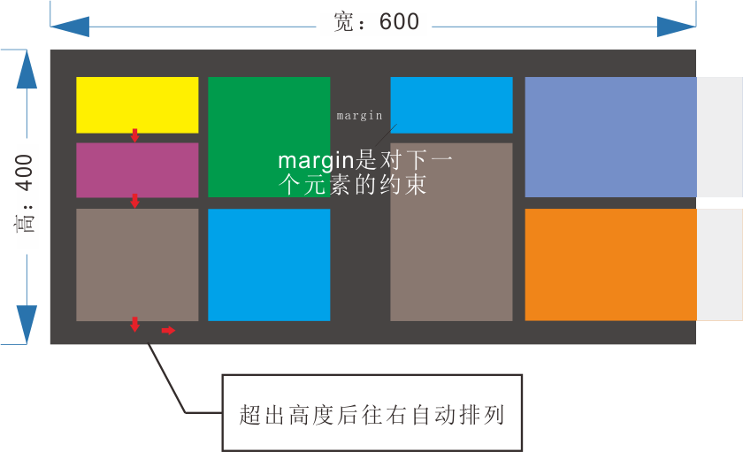

# GridLayout
Android扁平化设计-网格布局。

```
1.Add it in your root build.gradle at the end of repositories （添加maven仓库到根目录下的build.gradle）:

allprojects {
	repositories {
		...
		maven { url 'https://jitpack.io' }
	}
}

2.Add the dependency（添加依赖到app下的build.gradle）

dependencies {
	...
	compile 'com.github.xuehuiniaoyu:GridLayout:1.0-beta'
}

```


